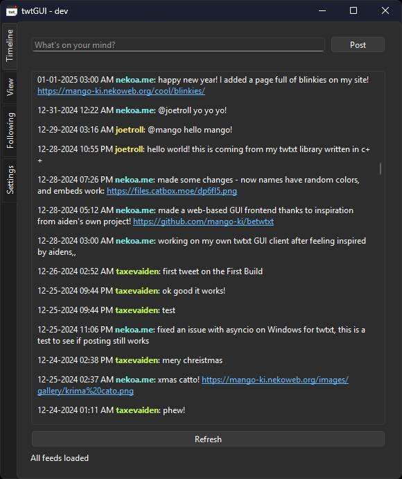

  

# twtGUI

twtGUI is a graphical client for twtxt.

Currently the twtxt v1 specification is implemented, but the revised specification (described over at https://twtxt.dev/) will be implemented soon.

   
  The client in action

## Features

- Post tweets 
- View timeline
- View other twtxt.txts
    - Caches other twtxt.txts
- Manage who you follow
- Tweak some settings
    - Nickname
    - twtxt.txt filepath
    - URL to your public twtxt.txt
    - Toggle whether the names in the time will be colored or not

## Installing

You can download the latest version [here.](https://github.com/taxevaiden/twtGUI/releases)

`twtGUI-windows-x64.zip` has all of the dependencies inside by default and should work just fine, however `twtGUI-linux-x64.zip` (built using ubuntu) is different.

For Linux, you will need

- Qt 6.10.1 installed (You may have to manually compile it yourself as from my experience `apt` has an older version of Qt6)
- curl installed

### Compatibility

This client has been verified to work on Windows and Linux. macOS hasn't been verified yet, but it should work if all the dependencies are installed correctly.

## Compiling

### Prerequisites

- Qt 6.10.1
- libcurl installed (This should be installed already if you have curl, but if it isn't you will have to install libcurl yourself)
- CMake
- Ninja
- C++ compiler (mingw-g++ for Windows, g++ for Linux)

If you're on Windows, you will need to install all of these using msys2 and compile using msys2 (I used the mingw64 shell):
- `mingw-w64-x86_64-qt6-base` (Qt6)
- `mingw-w64-x86_64-curl` (curl)
- `mingw-w64-x86_64-cmake` (CMake)
- `mingw-w64-x86_64-ninja` (Ninja)
- `mingw-w64-x86_64-toolchain` (gcc and g++)

Clone the repo, `cd` into it and create the build directory:

    mkdir build
    cd build

Now generate the build files:

> [!IMPORTANT]
> I have no idea why, but building with the build type "Debug" results in an executable that does not work at all. When running a debug build and simply clicking "Refresh" after either the timeline or the view feed loads, you get this error:
> `Thread 1 received signal ?, Unknown signal.`
> Again, I have no idea how this happened (i'm being so serious it just started happening randomly) but building with release optimizations seems to fix this (again no idea how/why). For now, build with release optimizations either with
> `-DCMAKE_BUILD_TYPE:STRING=RelWithDebInfo` or `-DCMAKE_BUILD_TYPE:STRING=Release`
> when generating the build files.

    cmake -S .. -B . -G Ninja

Now you can build!

    cmake --build .

The final executable will be located in the `build` directory you created.
