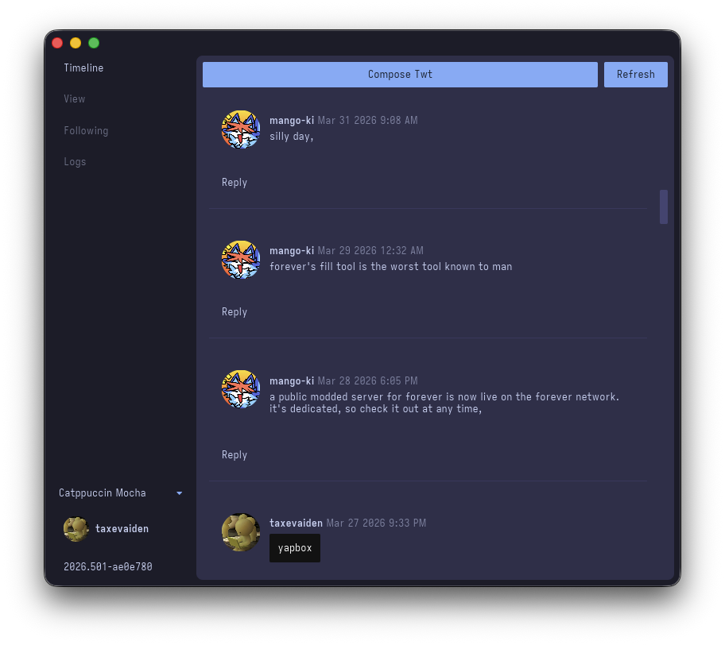

<p align="center">
  
</p>

<h1 align="center">twtGUI</h1>

<p align="center">A graphical client for twtxt, a decentralized microblogging protocol based on plain text files.</p>

<p align="center">
  
</p>
 
> [!IMPORTANT]
> This project is under active development and may introduce breaking changes! Please check for updates regularly.

## Installing

This client supports every desktop operating system (Windows, macOS, Linux). You can grab the latest release [here.](https://github.com/taxevaiden/twtGUI/releases/latest)

> **macOS note:** macOS may show a warning that twtGUI is damaged. 
> This is because the app is not notarized. Run:
> ```
> xattr -cr /path/to/twtGUI.app
> ```
> Then open the app normally.

If you encounter any issues, [please open a bug report!](https://github.com/taxevaiden/twtGUI/issues/new?template=bug_report.yml)

If you want to see a new feature or an improvement, [please open a feature request!](https://github.com/taxevaiden/twtGUI/issues/new?template=feature_request.yml)

## Building

You will need the following prerequisites:

- Rust
- Cargo

You can install both of these through [Rustup.](https://rustup.rs/)

After installing, simply clone this repository and run twtGUI:

    git clone https://github.com/taxevaiden/twtGUI
    cd twtGUI
    cargo run            # debug build
    cargo run --release  # optimized build (slower to compile, faster to run)

Cargo should automatically install any dependencies.

## Contributing

Please refer to [CONTRIBUTING.md.](CONTRIBUTING.md)

## Features

- Tweeting markdown-formatted posts
- Fetching viewing, and following feeds
- The [twtxt v2 specification](https://twtxt.dev)
  - [Mentions](https://twtxt.dev/#mentions-and-threads:~:text=Mentions%20in%20the,a%20Twtxt%20URI.)
  - [Twt Hash Extension](https://twtxt.dev/exts/twt-hash.html)
  - [Twt Subject Extension](https://twtxt.dev/exts/twt-subject.html)
  - [Multiline Extension](https://twtxt.dev/exts/multiline.html)
  - [Metadata Extension](https://twtxt.dev/exts/metadata.html)
  - [Archive Feeds Extension](https://twtxt.dev/exts/archive-feeds.html)

If you're someone whose `twtxt.txt` only follows the twtxt v1 specification, this client's great for you!

If you're someone whose `twtxt.txt` follows the twtxt v2 specification, expect some features to be missing.

## Configuration

twtGUI uses a `config.toml` file to store user settings and follow information.  
The file is automatically created on first launch if it does not already exist.

There is currently no dedicated settings page in twtGUI, so you must edit `config.toml` manually to change settings such as your nickname or the path to your `twtxt.txt` file.

However, feeds you follow can be managed through the **Following** page inside twtGUI.

If you need to edit `config.toml`, you can find it in your system’s configuration directory:

| Platform | File path |
|----------|-----------|
| Windows  | `C:\Users\yourname\AppData\Roaming\taxevaiden\twtGUI\config\config.toml` |
| macOS    | `/Users/yourname/Library/Application Support/com.taxevaiden.twtGUI/config.toml` |
| Linux    | `/home/yourname/.config/twtgui/config.toml` |

The configuration file is divided into three main sections:

- `[appearance]`
- `[metadata]`
- `[paths]`

---

### `[appearance]`

Contains settings for the appearance of twtGUI.

- `theme`
  The UI theme. You won't usually need to set this theme, as there is a theme-switcher built into twtGUI. Accepted values:
  - `light` - Light
  - `dark` - Dark
  - `system` - Light or Dark, depends on system theme
  - `catppuccinmocha` - Catppuccin Mocha **(default)**
  - `catppuccinfrappe` - Catppuccin Frappe
  - `catppuccinmacchiato` - Catppuccin Macchiato
  - `catppuccinlatte` - Catppuccin Latte
  - `gruvboxlight` - Gruvbox Light
  - `gruvboxdark` - Gruvbox Dark
  - `gruvboxsystem` - Gruvbox Light or Dark, depends on system theme

### `[metadata]`

Contains information about you and your twtxt identity.

These values are stored locally in `config.toml`, and will be automatically written to your `twtxt.txt` file when saved.

- `urls`  
  A list of public URLs pointing to your `twtxt.txt` file.  
  Typically this contains a single URL.

- `nick`  
  Your display name.

- `avatar`  
  A URL pointing to an image, used as your profile picture.

- `description`  
  A short bio or description of your feed.

- `kind`  
  The type of feed.  
  Common values include:
  - `"bot"` - automated account  
  - `"rss"` - RSS-to-twtxt feed  
  If not set, the feed is assumed to be human-managed.

- `follows`  
  A list of feeds you follow (managed by twtGUI). Each entry contains:
  - `text` - The display name of the feed.
  - `url` - The feed’s `twtxt.txt` URL.

- `following`  
  The number of feeds this feed follows.  
  This is automatically set by twtGUI based on the number of entries in `follows`.

- `links`  
  Additional profile links. Each entry contains:
  - `text` - A label (for example, `"GitHub"`)
  - `url` - The associated URL  
  These may be shown on a user’s profile page.

- `prev`  
  A list of archived feeds. Each entry contains:
  - `text` - The hash of the last tweet in the feed.
  - `url` - The feed’s `twtxt.txt` URL.

- `refresh`  
  A suggested refresh interval (in seconds) for how often clients should fetch the feed.

#### Example

```toml
[metadata]
nick = "john"
urls = ["https://example.com/twtxt.txt"]
description = "My personal twtxt feed"
avatar = "https://example.com/avatar.png"
kind = "user"
refresh = 600

[[metadata.follows]]
text = "jane"
url = "https://someone.dev/twtxt.txt"

[[metadata.links]]
text = "GitHub"
url = "https://github.com/username"

[[metadata.prev]]
text = "abc1234"
url = "https://old.example.com/twtxt.txt"
```

```
# written into twtxt.txt

# nick = john
# url = https://example.com/twtxt.txt
# description = My personal twtxt feed
# avatar = https://example.com/avatar.png
# kind = user
# refresh = 600
# following = 1
# follow = jane https://someone.dev/twtxt.txt
# link = GitHub https://github.com/username
# prev = abc1234 https://example.com/twtxt-2017-2-7.txt

2026-03-01T03:10:17Z	Hello everyone!
2026-03-01T04:21:27Z	(#abc1234) Hello?
2026-03-01T04:21:57Z	@<taxevaiden https://taxevaiden.pages.dev/twtxt.txt>?
```

### `[paths]`

Contains the filepaths to three files: the local `twtxt.txt` file, and three scripts.

- `twtxt`  
  The filepath to your local `twtxt.txt` file.
  New posts are appended to this file when you publish a tweet.

- `pre_tweet_script`  
  The filepath to a script to run before posting a tweet.

- `tweet_script`
  The filepath to a script to run when posting a tweet.  
  When this is set, the tweet is not automatically appended to `twtxt.txt` by twtGUI and is instead passed to the `tweet_script` as an argument.
  The timestamp is **not** passed to the script, so your script must handle timestamp formatting itself.

- `post_tweet_script`  
  The filepath to a script to run after posting a tweet.
  

#### Example

```toml
[paths]
twtxt = "C:/path/to/twtxt.txt"
pre_tweet_script = "C:/path/to/pre_tweet_script.bat"
tweet_script = "C:/path/to/tweet_script.bat"
post_tweet_script = "C:/path/to/post_tweet_script.bat"
```

Script files should be in `.bat` format on Windows, and in `.sh` format on Unix-like systems.

---

## License

twtGUI is licensed under the MIT License. See the [LICENSE](LICENSE) file for details.

twtGUI uses the Iosevka font family, which is licensed under the SIL Open Font License. See the [Iosevka](https://github.com/be5invis/Iosevka) repository for details.
